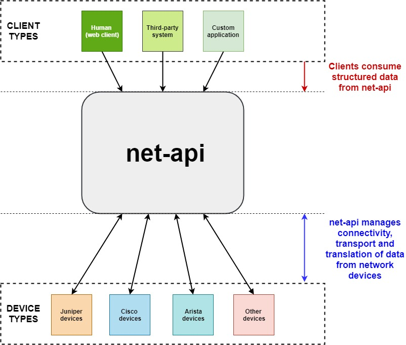

# net-api

A documented REST API which returns structured data from network devices

## net-api Overview




## Supported Environments

This application is only supported on:
 - Python 3.6 or greater
 - Linux/unix machines only

## Running in standard Python environment

The most popular way of running this application is using it in a standard Python environment. To do so, please follow the options below:

1) Clone the repository to the machine on which you will run the application from:

```git
git clone https://github.com/writememe/net-api.git
cd net-api
```

2) Populate your Nornir inventory files:

    - [defaults.yaml](app/inventory/defaults.yaml)
    - [groups.yaml](app/inventory/groups.yaml)
    - [hosts.yaml](app/inventory/hosts.yaml)

3) Create the virtual environment to run the application in and install the requirements. For your convenience, this can be completed by performing the following:

```console
make venv
```

5) Set two environmental variables, which are used by the application as the default credentials to login to devices:

```bash
export NORNIR_DEFAULT_USERNAME=<someusername>
export NORNIR_DEFAULT_PASSWORD=<somepassword>
```
5) Validate these environmental variables by entering the following command:

```
env | grep NORNIR
```
You should see the two environment variables set.

6) Setup an environmental variable to point to the NTC templates directory for TextFSM functionality.

In the example below, the virtual environment is using `python3.6`. You will need to adjust this if using anything else:

```bash
export NET_TEXTFSM=$VIRTUAL_ENV/lib/python3.6/site-packages/ntc_templates/templates
```

7) Validate these environmental variables by entering the following command:

```
env | grep NET_TEXTFSM
```
You should see th environment variable set.

8) Change to the `app/` directory, then start the flask application:

```python3
cd app
python webapp.py
```

9) The application will now be running on TCP/5000. For example, if the client IP is 10.0.0.1, the application will be available on http://10.0.0.1:5000

## Running in Docker

There is an option to buile this application in a Docker image and run it as a container. To do so, please follow the options below:

1) Clone the repository to the machine on which you will run the Docker container from:

```git
git clone https://github.com/writememe/net-api.git
cd net-api
```

1) Populate your Nornir inventory files:

    - [defaults.yaml](app/inventory/defaults.yaml)
    - [groups.yaml](app/inventory/groups.yaml)
    - [hosts.yaml](app/inventory/hosts.yaml)
    
2) Build the Docker image, whereby `net-api` is the name of the image and `latest` is an arbitary docker tag:

```dockerfile
docker build -t net-api:latest .
```

3) Create a file of environmental variables, to be passed into the Docker image as it's starting up.  
   In the below example, the file `.env-vars` contains the `NORNIR_DEFAULT_USERNAME` and `NORNIR_DEFAULT_PASSWORD` environmental
   variables
   
```bash
.env-vars	
NORNIR_DEFAULT_USERNAME=<someadmin>
NORNIR_DEFAULT_PASSWORD=<somepassword>
```

4) Run the docker build, passing in the environment variables in Step 3. This will expose the build on port 5000:

```dockerfile
docker run -d --env-file=.env-vars -p 5000:5000 net-api:latest
```


5) Verify that the container is up and operational, by running `docker ps`:

```dockerfile
$ docker ps
CONTAINER ID        IMAGE               COMMAND               CREATED             STATUS              PORTS                    NAMES
fe8c0b858f18        net-api:latest      "python3 webapp.py"   21 minutes ago      Up 21 minutes       0.0.0.0:5000->5000/tcp   quizzical_rosalind
$
```

6) The application will now be running on TCP/5000. For example, if the client IP is 10.0.0.1, the application will be available on http://10.0.0.1:5000